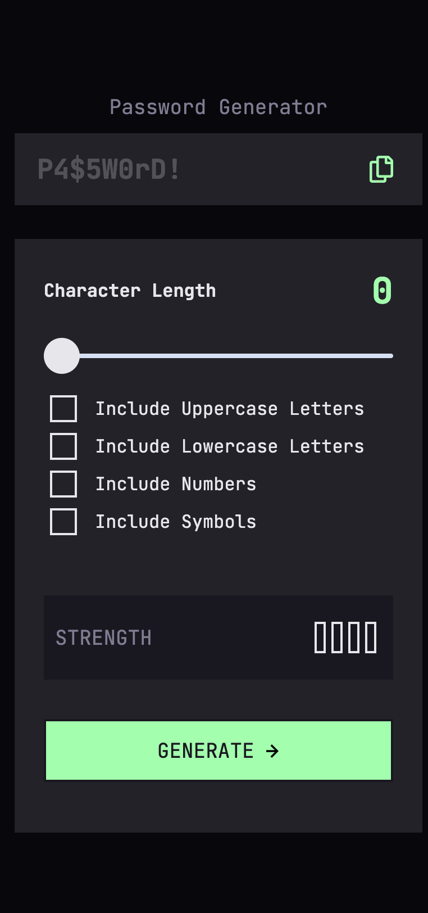
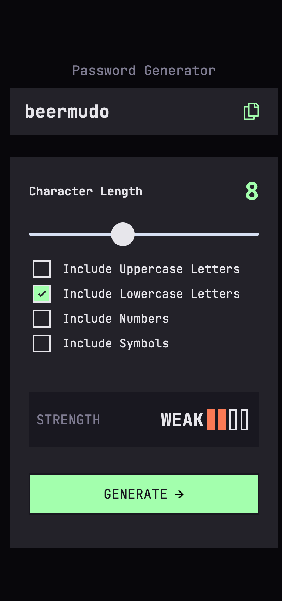
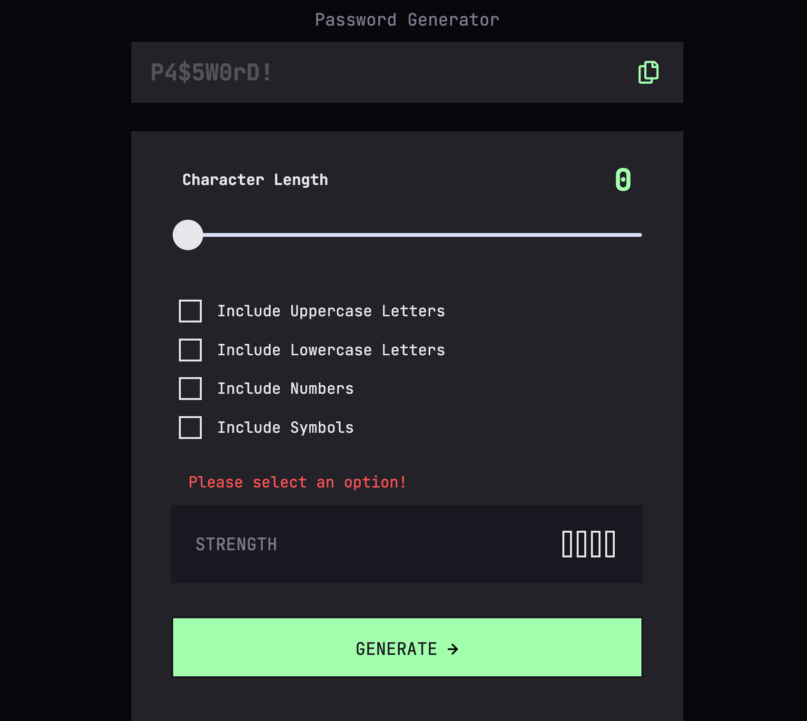
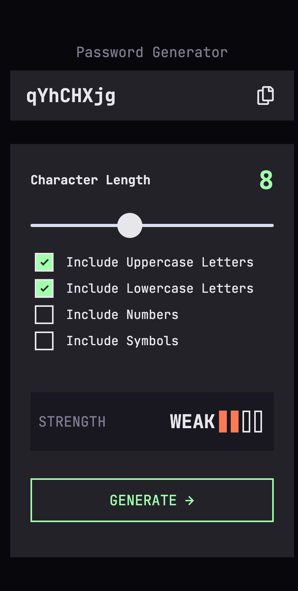
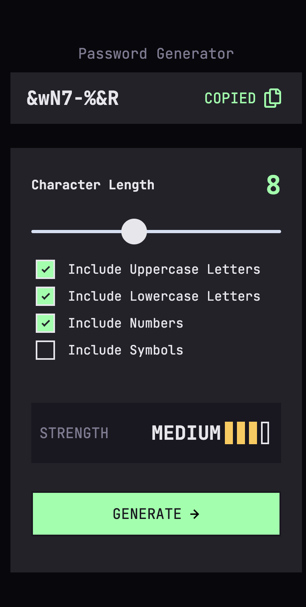
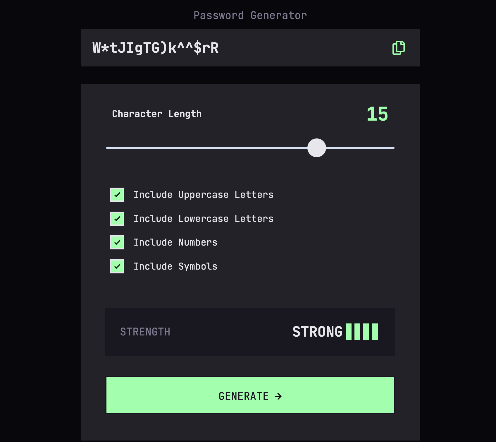

# Frontend Mentor - Password generator app solution


This is a solution to the [Password generator app challenge on Frontend Mentor](https://www.frontendmentor.io/challenges/password-generator-app-Mr8CLycqjh). Frontend Mentor challenges help you improve your coding skills by building realistic projects. 

## Table of contents

- [Overview](#overview)
  - [The challenge](#the-challenge)
  - [Screenshot](#screenshot)
  - [Links](#links)
- [My process](#my-process)
  - [Built with](#built-with)
  - [What I learned](#what-i-learned)
  - [Continued development](#continued-development)
  - [Useful resources](#useful-resources)
- [Author](#author)
- [Acknowledgments](#acknowledgments)

# Overview

## The challenge

Users should be able to:

- [X] Generate a password based on the selected inclusion options
- [X] Copy the generated password to the computer's clipboard
- [X] See a strength rating for their generated password
- [X] View the optimal layout for the interface depending on their device's screen size
  - [X] Mobile @ 375px
  - [X] Tablet @  768 px
  - [X] Desktop @ 1440px
- [X] See hover and focus states for all interactive elements on the page

##  Screenshots

### Mobile View @ `375px`

#### `ngOnit` Initial Screen


  
#### View with valid selections


#### Invalid Selection and Error Messages



#### "Generate" Button and "Copy" icon Hover States


#### After copying to clipboard  

 
### Tablet View @ `768px` && Desktop View @ `1440px`


##  Links

- Solution URL: [Click for Solution](https://github.com/Chanda-Abdul/frontend-mentor-angular-password-generator-app)
- Live Site URL: [Click for Live Site](https://stalwart-alpaca-aa2da3.netlify.app/)

## My process
This password generator was a fun and challenging to work on. great opportunity to use some new angular topics and implement some of algorithm knowledge.
### Project Structure
I also started this project with most of my finctionality in one component.  But as the codebase grew I decided it would be best to separate each interactive element into thier own component and service.  I ended up with
- <b>App Component</b>
  - [`<app-password-display>`]()
    - <b>Component: </b>[`password-display.component.ts`](/src/app/components/password-display/password-display.component.ts)
    - <b>Service: </b>[`passwordGeneration.service.ts`](/src/app/components/password-display/passwordGeneration.service.ts)
    - handles the functionality for displaying the inital password, the generated password, and the clipboard(copy password) status.

  - [`<app-slider>`](/src/app/components/slider/)
      - <b>Component: </b>[`slider.component.ts`](/src/app/components/slider/slider.component.ts)
    - <b>Service: </b>[`character-count.service.ts`](/src/app/components/slider/character-count.service.ts)
    - slider to keep track of the character count from <b>1</b> to <b>20</b> characters long.
 
  - [`<app-checkbox-options>`](/src/app/components/checkbox-options/)
      - <b>Component: </b> [`checkbox-options.component.ts`](/src/app/components/checkbox-options/checkbox-options.component.ts)
    - handles the `<input type="checkbox"/>` for the <b>lowercase</b>, <b>uppercase</b>, <b>number</b> and <b>symbol</b> password options
  - [`<app-strength-bar>`](/src/app/components/strength-bar/)
      - <b>Component: </b> [`strength-bar.component.ts`](/src/app/components/strength-bar/strength-bar.component.ts)
    - <b>Service: </b>[`strengthUpdate.service.ts`](/src/app/components/strength-bar/strengthUpdate.service.ts)
    - handles the functionality that determines the strength of the password based on the <b>lowercase</b>, <b>uppercase</b>, <b>number</b> and <b>symbol</b> password input options

### Password Algorithms
I realized that I would need to create two separate algorithms,   one algorithm to generate a password and another algorithm to determine the passwords' strength.
#### Password Generator Algorithm

  When I initially started to think of ways to generate a password I considered something like 
  `.charCodeAt()`
  but I thought that might be too complicated and inffecient

  So I decided it would be best to create an array for each of the password options
  ```js
  upperChars: string[] =
    ['A', 'B', 'C', 'D', 'E', 'F', 'G', 'H', 'I', 'J', 'K', 'L', 'M',
      'N', 'O', 'P', 'Q', 'R', 'S', 'T', 'U', 'V', 'W', 'X', 'Y', 'Z'];

  lowerChars: string[] =
    ['a', 'b', 'c', 'd', 'e', 'f', 'g', 'h', 'i', 'j', 'k', 'l', 'm',
      'n', 'o', 'p', 'q', 'r', 's', 't', 'u', 'v', 'w', 'x', 'y', 'z'];

  symbolChars: string[] =
    ['!', '@', '#', '$', '%', '^', '&', '*', '(', ')', '-', '+'];

  numChars: string[] =
    ['0', '1', '2', '3', '4', '5', '6', '7', '8', '9'];
 ``` 
 and based on the user input options an <b>Array</b> of `availableChars` would be created to generate the password
 ```js
 availableChars: string[] = [];

 availableChars = [...upperChars, ...lowerChars, ...symbolChars, ...numChars];
 ```
 <b>Space Complexity:</b> 
 - `upperChars` = <b>O(26)</b>
 - `lowerChars` = <b>O(26)</b>
 - `symbolChars` = <b>O(12)</b>
 - `numChars`= <b>O(10)</b>
 - ❓ `availableChars`= <b>O(1)</b>
 - ❓`currentCharCount`= <b>O(1)</b>
 - ❓`password`= <b>O(1)</b>

 - <b>Total Space = O(77) or O(N)</b>

<b>Time Complexity:</b>
- choose a random available character in  `availableChars[]` for each length of the character length `currentCharCount`
```js
  setPassword(upper: boolean, lower: boolean, number: boolean, symbol: boolean) {
    const currentCharCount = this.characterCountService.getCurrentCharacterCount()
    ...
    this.getAvailableChars(upper, lower, number, symbol)

    const createPassword = []

    for (let i = 1; i <= currentCharCount; i++) {
      
      createPassword
        .push(this.availableChars[Math.floor(Math.random() * this.availableChars.length)]);
    }
    ...
    
  }
```
 - <b>Total Time = O(N)</b> because of the `for` loop 
### Password Strength Algorithm


## Built with

- <b>[Angular](https://angular.io/)</b> (<b>JavaScript</b> framework)
  - [Angular Material](https://material.angular.io/)
  - [TypeScript](https://www.typescriptlang.org/)
  - [JavaScript](https://www.javascript.com/)
- <b>[Sass](https://sass-lang.com/)/CSS</b> custom properties
  - <b>Mobile-first</b> workflow
- Semantic <b>HTML5</b> markup
- <b>Figma</b>

## What I learned
- Semantic Input
- I used [Angular Material - Clipboard](https://material.angular.io/cdk/clipboard/overview) to copy the generated password the users clipboard. `setTimeout()` is to reset the styling 5 seconds after copying the password.

  ```js
  import { Clipboard } from '@angular/cdk/clipboard';

  ...

  passwordCopied = false;

  ...

  copyPasswordToClipboard(){
      this.clipboard.copy(this.password);

      this.passwordCopied = true;
      
      setTimeout(() => {
        this.passwordCopied = false
      }, 5000);
    }
  ```
- @Input
- @Output
- Services
- Event binding
- algorithms

```html
<h1>Some HTML code I'm proud of</h1>
```
```css
.proud-of-this-css {
  color: papayawhip;
}
```
```js
const proudOfThisFunc = () => {
  console.log('🎉')
}
```

##  Continued development

- [ ] disable "generate" button if no inputs are selected
- [ ] finish slider styling
- [ ] update strength level based on character length


## Useful resources

- [angular-range-slider-example-draggable-ngx-slider-tutorial](https://www.freakyjolly.com/angular-range-slider-example-draggable-ngx-slider-tutorial/) - This helped me for XYZ reason. I really liked this pattern and will use it going forward.
- [ CSS Checkbox Generator](https://doodlenerd.com/html-control/css-checkbox-generator) - This is an amazing article which helped me finally understand XYZ. I'd recommend it to anyone still learning this concept.
- [Introduction to services and dependency injection](https://angular.io/guide/architecture-services) - This helped me for XYZ reason. I really liked this pattern and will use it going forward.
- [List of Unicode characters](https://en.wikipedia.org/wiki/List_of_Unicode_characters) - This is an amazing article which helped me finally understand XYZ. I'd recommend it to anyone still learning this concept.
- [Angular Material - Clipboard](https://material.angular.io/cdk/clipboard/overview) - This helped me for XYZ reason. I really liked this pattern and will use it going forward.
- [Example resource 2](https://www.example.com) - This is an amazing article which helped me finally understand XYZ. I'd recommend it to anyone still learning this concept.
- [angular-range-slider-example-draggable-ngx-slider-tutorial](https://www.freakyjolly.com/angular-range-slider-example-draggable-ngx-slider-tutorial/) - This helped me for XYZ reason. I really liked this pattern and will use it going forward.
- [10 Best CSS button hover effects](https://alvarotrigo.com/blog/best-css-button-hover-effects/) - This is an amazing article which helped me finally understand XYZ. I'd recommend it to anyone still learning this concept.


## Author

- Frontend Mentor - [@Chanda-Abdul](https://www.frontendmentor.io/profile/Chanda-Abdul)
- Website - [Chanda Codes](https://chandacodes.com/)
- GitHub - [github.com/Chanda-Abdul](https://github.com/Chanda-Abdul)


## Acknowledgments


